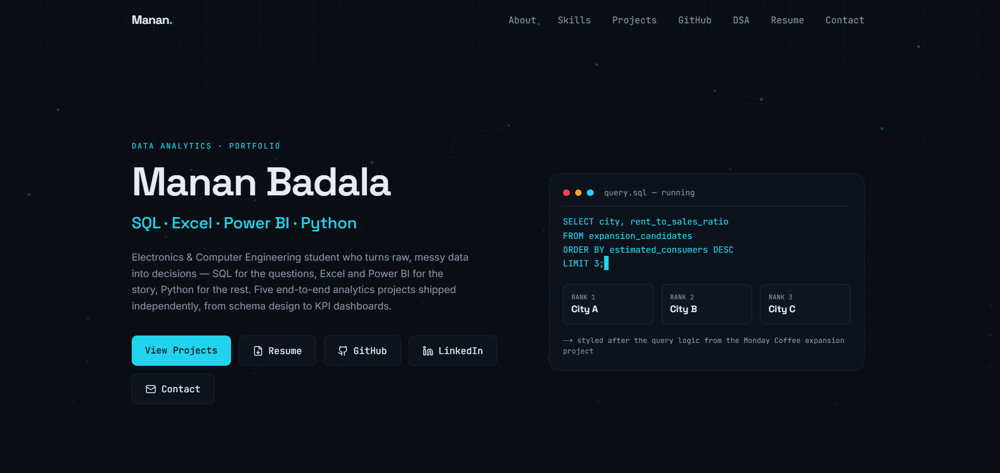
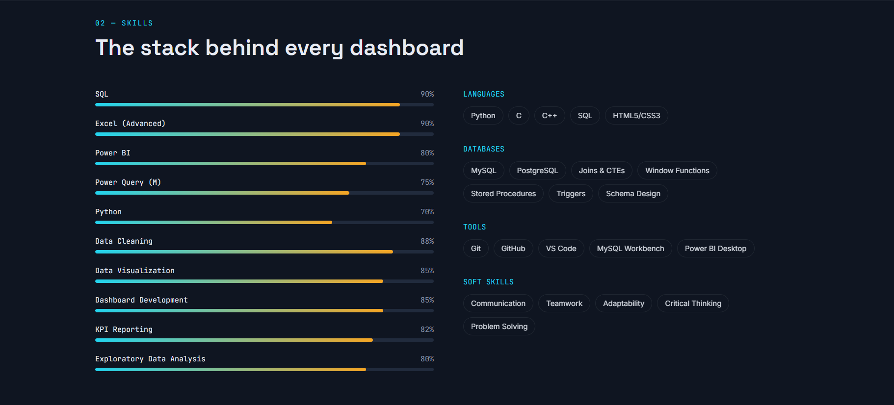
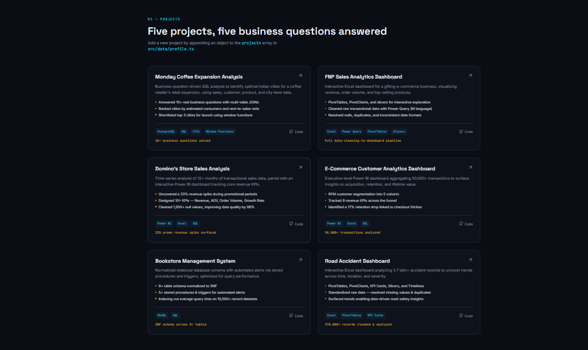
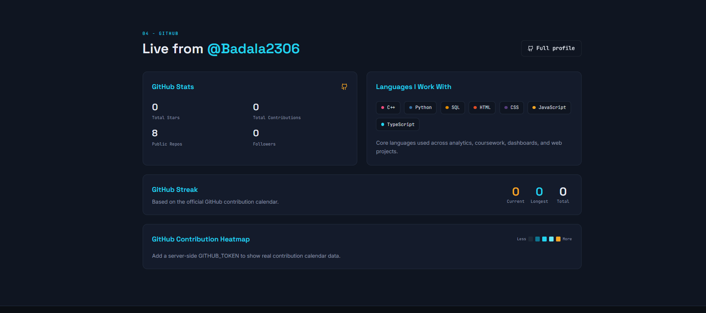
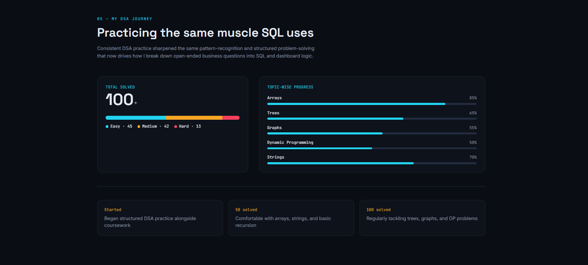

<div align="center">

# 🚀 Manan Badala

### Data Analytics Portfolio

Transforming raw data into actionable business insights using **SQL • Python • Excel • Power BI**

### 🌐 **[View Live Portfolio →](https://manan-badala.vercel.app/)**

<br>

<a href="https://manan-badala.vercel.app/" target="_blank">
  
</a>
&nbsp;
<a href="https://github.com/Badala2306">
  
</a>
&nbsp;
<a href="https://www.linkedin.com/in/manan-badala-0a4488297/">
  
</a>

<br><br>


</div>

---

# 📸 Preview

<p align="center">

</p>

<br>

<p align="center">

&nbsp;

</p>

<p align="center">

&nbsp;

</p>

---

# ✨ Highlights

- 🎯 Animated Hero Section
- ⚡ Live SQL Query Animation
- 🌌 Mouse-Reactive Particle Background
- 📊 Featured Analytics Projects
- 📈 Interactive Skill Visualizations
- 🐙 Live GitHub Statistics
- 🧩 DSA Progress Tracker
- 🏆 Certifications
- 📄 Resume Viewer & Download
- 📬 Functional Contact Form
- 📱 Fully Responsive Design

---

# 📂 Featured Projects

| Project | Description | Tech |
|----------|-------------|------|
| ☕ Monday Coffee Expansion Analysis | SQL-driven city expansion analysis | PostgreSQL |
| 🌸 FNP Sales Dashboard | Interactive sales dashboard | Excel |
| 🍕 Domino's Sales Analysis | KPI & sales insights dashboard | Power BI |
| 🛒 E-Commerce Analytics | Customer segmentation (RFM) | SQL, Power BI |
| 📚 Bookstore Management System | Relational database design | MySQL |
| 🚗 Road Accident Dashboard | Trend & accident analysis | Excel |

---

# 🛠 Tech Stack

### Frontend

- Next.js
- TypeScript
- Tailwind CSS
- Framer Motion

### Data Analytics

- SQL
- PostgreSQL
- MySQL
- Python
- Excel
- Power BI
- Power Query

### Tools

- Git
- GitHub
- VS Code
- Vercel

---

# 🚀 Run Locally

```bash
git clone https://github.com/Badala2306/YOUR_REPOSITORY_NAME.git

cd YOUR_REPOSITORY_NAME

npm install

npm run dev
```

Open:

```
http://localhost:3000
```

---

# 📊 Portfolio Snapshot

| Category | Details |
|-----------|---------|
| Analytics Projects | 6+ |
| SQL | PostgreSQL, MySQL |
| Dashboards | Power BI, Excel |
| Programming | Python |
| Frontend | Next.js, TypeScript |
| Deployment | Vercel |

---
---


## 📈 GitHub Stats

<p align="center">
  
  
</p>

# 📬 Connect With Me

<div align="center">

<a href="https://manan-badala.vercel.app/">

</a>

<a href="mailto:mananbadala30@gmail.com">

</a>

<a href="https://github.com/Badala2306">

</a>

<a href="https://www.linkedin.com/in/manan-badala-0a4488297/">

</a>

</div>

---

<div align="center">

## ⭐ If you enjoyed this project, consider giving it a star!

Made with ❤️ by **Manan Badala**

</div>
